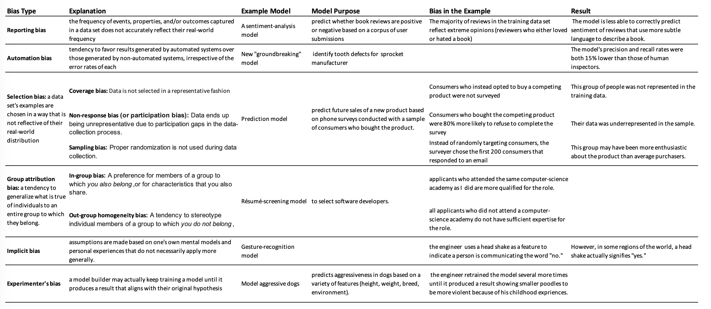

### Static and Dynamic Models

Static Model -- Trained Offline

- Easy to build and test -- use batch train & test, iterate until good.
- Still requires monitoring of inputs
- Easy to let this grow stale

We can use it when the input data is not going to be change over time. 

Ex: a large image recognition model, where there aren't that many new kinds of objects that come into the world.

Dynamic Model -- Trained Online

- Continue to feed in training data over time, regularly sync out updated version.
- Use progressive validation rather than batch training & test
- Needs monitoring, model rollback & data quarantine capabilities
- Will adapt to changes, staleness issues avoided

Online training might be more appropriate for situations where there are trends and seasonalities that change 
quite often over time and we want to make sure that we're as up to date as possible.

Notes: 

In general, monitoring requirements at training time are more modest for offline training, 
which insulates us from many production considerations. 

However, the more frequently you train your model, the higher the investment you'll need to make in monitoring. 
You'll also want to validate regularly to ensure that changes to your code (and its dependencies) don't adversely 
affect model quality.

Offline training gives ample opportunity to verify model performance before introducing the model in production.

### Inferences

You can choose either of the following inference strategies:

- Offline inference: 

    - meaning that you make all possible predictions in a batch, using a MapReduce or something similar. 
    - You then write the predictions to an SSTable or Bigtable, and then feed these to a cache/lookup table.
    - Upside: don't need to worry much about cost of inference.
    - Upside: can likely use batch quota.
    - Upside: can do post-verification on predictions on data before pushing.
    - Downside: can only predict things we know about -- bad for long tail.
    - Downside: update latency likely measured in hours or days.
    
- Online inference: 
    - meaning that you predict on demand, using a server.
    - Upside: can predict any new item as it comes in -- great for long tail.
    - Downside: compute intensive, latency sensitive -- may limit model complexity.
    - Downside: monitoring needs are more intensive.
    
    
### Notes

1. Offline inference, For a given input, can serve a prediction more quickly than with online inference.

    One of the great things about offline inference is that once the predictions have been written to some look-up table,
    they can be served with minimal latency. 
    
    No feature computation or model inference needs to be done at request time.
    
2. We will not have predictions for all possible inputs in offline inference.

    We will only be able to serve a prediction for those examples that we already know about. 
    
    This is fine if the set of things that we're predicting is limited, like world cities. 
    
    But for things like user queries that have a long tail of unusual or rare items, we may not be able to provide full 
    coverage with an offline-inference system.
    
3. We don't need to monitor input signals over a long period of time in offline inference.
 
    This is because once the predictions have been written to a look-up table, we're no longer dependent on the input 
    features. 
    
    Note that any subsequent update of the model will require a new round of input verification.
    
4.  You must carefully monitor input signals in online inferences.
    
    Signals could change suddenly due to upstream issues, harming our predictions.   
    
5. You can provide predictions for all possible items in online inferences.

   This is a strength of online inference. Any request that comes in will be given a score. 
   
   Online inference handles long-tail distributions (those with many rare items), like the space of all possible 
   sentences written in movie reviews.
   
6. Prediction latency is often a real concern in online inference. 

   Unfortunately, you can't necessarily fix prediction latency issues by adding more inference servers.

### Example models that are susceptible to a feedback loop:

1. A traffic-forecasting model that predicts congestion at highway exits near the beach, 
using beach crowd size as one of its features.

    Some beachgoers are likely to base their plans on the traffic forecast. 
    If there is a large beach crowd and traffic is forecast to be heavy, many people may make alternative plans. 
    This may depress beach turnout, resulting in a lighter traffic forecast, 
    which then may increase attendance, and the cycle repeats.

2. A university-ranking model that rates schools in part by their selectivity—the percentage of students 
who applied that were admitted.

    The model's rankings may drive additional interest to top-rated schools, increasing the number of applications they 
    receive. If these schools continue to admit the same number of students, selectivity will increase 
    (the percentage of students admitted will go down). This will boost these schools' rankings,
     which will further increase prospective student interest, and so on…

3. A book-recommendation model that suggests novels its users may like based on their popularity 
(i.e., the number of times the books have been purchased).

    Book recommendations are likely to drive purchases, and these additional sales will be fed back into the model as 
    input, making it more likely to recommend these same books in the future.

### Fairness

Evaluating a machine learning model responsibly requires doing more than just calculating loss metrics. 
Before putting a model into production, it's critical to audit training data and evaluate predictions for bias.

Let's look at different types of human biases that can manifest in training data. 
We also provide strategies to identify them and evaluate their effects.

Identifying Bias:

- Check missing values
- Check is there any unexpected Feature Values
- Any sort of skew in your data

### Evaluating Bias

Consider a new model developed to predict the presence of tumors that is evaluated against 
        
        a validation set of 1,000 patients' medical records. 
        500 records are from female patients, 
        500 records are from male patients.
        
Confusion Matrix for 1000 patients:

|   | actual = 1  | actual = 0  |
|---|---|---|
| pred = 1  | TP = 16 | FP = 4  |  
| pred = 0 | FN  = 6 | TN = 974| 

- Precision = 0.8
- Recall = 0.727  Great!

Confusion Matrix for 500 male patients:

|   | actual = 1  | actual = 0  |
|---|---|---|
| pred = 1  | TP = 6 | FP = 3  |  
| pred = 0 | FN  = 5 | TN = 486|  

- Precision = 0.667
- Recall = 0.545  oh no!   
    
    
Confusion Matrix for 500 female patients:

|   | actual = 1  | actual = 0  |
|---|---|---|
| pred = 1  | TP = 10 | FP = 1  |  
| pred = 0 | FN  = 1 | TN = 488|     

- Precision = 0.909
- Recall = 0.909  that's great but something wrong with male patients. :(

We now have a much better understanding of the biases inherent in the model's predictions, as well as the risks to 
each subgroup if the model were to be released for medical use in the general population.

Additional info: 

https://developers.google.com/machine-learning/fairness-overview

### Example
A sarcasm-detection model was trained on 80,000 text messages: 
- 40,000 messages sent by adults (18 years and older) 
- 40,000 messages sent by minors 

a positive prediction signifies a classification of "sarcastic"; a negative prediction signifies a classificaton of "not sarcastic"

#### Confusion Matrix for Adults:

|   | actual = 1  | actual = 0  |
|---|---|---|
| pred = 1  | TP = 512 | FP = 51  |  
| pred = 0 | FN  = 36 | TN = 9401 |  

    - Precision = 0.909
    - Recall = 0.934 

- This is an imbalanced data. Since sum(actual=1) = 548 while sum(actual=0) = 9452

- Overall, the model performs better on examples from adults than on examples from minors.

- The model achieves both precision and recall rates over 90% when detecting sarcasm in text messages from adults.

#### Confusion Matrix for Minors:

|   | actual = 1  | actual = 0  |
|---|---|---|
| pred = 1  | TP = 2147 | FP = 96  |  
| pred = 0 | FN  = 2177 | TN = 5580|     

    - Precision = 0.957
    - Recall = 0.497

- This is a balanced data. Since sum(actual=1) = 4324 while sum(actual=0) = 5676

- The model fails to classify approximately 50% of minors' sarcastic messages as "sarcastic."
- The recall rate of 0.497 for minors indicates that the model predicts "not sarcastic" for approximately 50% of minors' sarcastic texts.

Question: Engineers are working on retraining this model to address inconsistencies in sarcasm-detection accuracy across
 age demographics, but the model has already been released into production. Which of the following stopgap strategies 
 will help mitigate errors in the model's predictions?
 
Solutions:

1. Restrict the model's usage to text messages sent by adults.

    The model performs well on text messages from adults (with precision and recall rates both above 90%), so restricting
    its use to this group will sidestep the systematic errors in classifying minors' text messages.
    

2. When the model predicts "not sarcastic" for text messages sent by minors, adjust the output so the model returns 
a value of "unsure" instead.

    The precision rate for text messages sent by minors is high, which means that when the model predicts "sarcastic" 
    for this group, it is nearly always correct.

    The problem is that recall is very low for minors; The model fails to identify sarcasm in approximately 50% of examples. 
    Given that the model's negative predictions for minors are no better than random guesses, we can avoid these errors by 
    not providing a prediction in these cases.
    

DON'T: Adjust the model output so that it returns "sarcastic" for all text messages sent by minors, 
regardless of what the model originally predicted.

Always predicting "sarcastic" for minors' text messages would increase the recall rate from 0.497 to 1.0, 
as the model would no longer fail to identify any messages as sarcastic. 

However, this increase in recall would come at the expense of precision. 

All the true negatives would be changed to false positives:

|   | actual = 1  | actual = 0  |
|---|---|---|
| pred = 1  | TP = 4324 | FP = 5676 |  
| pred = 0 | FN  = 0 | TN = 0|   

which would decrease the precision rate from 0.957 to 0.432. 
So, adding this calibration would change the type of error but would not mitigate the magnitude of the error.

DON'T: Restrict the model's usage to text messages sent by minors.
The systematic errors in this model are specific to text messages sent by minors. 
Restricting the model's use to the group more susceptible to error would not help.