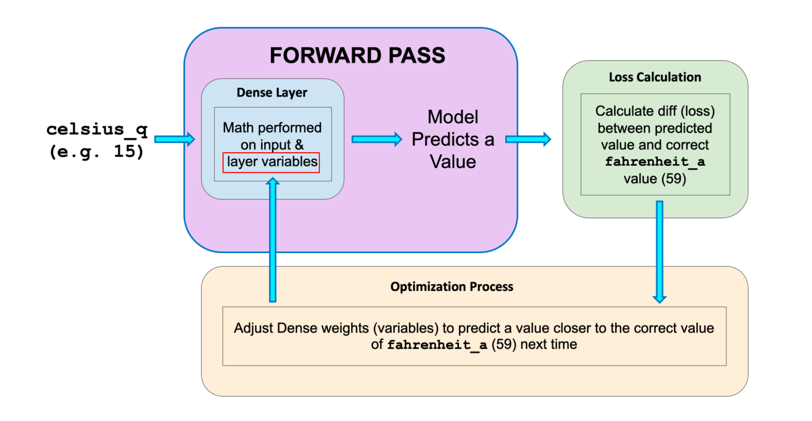
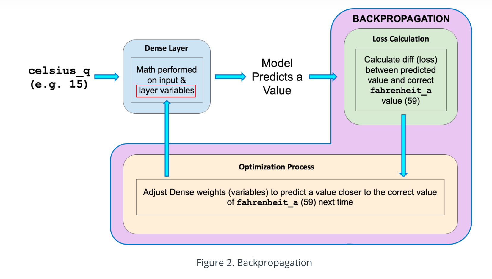

#### Terminology

💛 Forward Pass: the computation of output from input

💛 Backpropagation: the calculation of internal variable adjustments according to the optimizer algorithm, 
starting from output layer, working back through each layer to input. 

💛 Dense Layer or Fully Connected Layer: every neuron in each layer s connected to all neurons in the previous layer. 

2 ways to build keras model:
- Sequential: No multiple inputs or outputs. It is a linear stack of layers. 
- Functional: More flexible, you can connect the layers to any other layer. 

💛 output = activation(data(input, kernel) + bias) 

activation ex: relu
kernel is weights matrix. 

#### Regularization

In order to avoid overfitting we can use regularization. 
In each iteration the loss of training model can go down --> it is ok. But with each iteration if the validation set loss 
increase ---> this is overfitting. 

Regularization techniques: 

💛 Dropout regularization (neural network)

💛 Early Stopping

💛 Penalize the model complexity (L1, L2) --> Structural Risk Minimization 

Regularization in model:

minimize loss(data | model) + complexity (model)

####  How to define complextiy?

Complexity of the model = Sum of the squares of the weights. 
Using L2 regularization, penalize really big weights. 

In bayesian prior, the weights should be centered around 0 and weights should be normally distributed. 

💛 Loss function in L2 regularization: loss(data | model) + &lambda; (w1^2 + w2^2 + .... + wn^2)

- loss(data | model) --> aims for lower training error. 
- &lambda; ---> regularization rate, scalar value tjat controls how weights are balanced.
- (w1^2 + w2^2 + .... + wn^2) ---> regularization term. (square of L2 norm)
- &lambda; (w1^2 + w2^2 + .... + wn^2) ---> doesn't depend on data.

#### When do we need regularization? 

If you've LOTS OF TRAINING DATA and TRAINING & TEST DATA are I.I.D ---> you DON'T NEED MUCH REGULARIZATION

If you DON'T HAVE MUCH TRAINING DATA or TRAINING & TEST DATA are DIFFERENT ---> you NEED REGULARIZATION
and yıu may want to tune that with cross validation or with a separate test.

#### Regularization Rate

If &lambda; value is HIGH; the model will be SIMPLE (there is TOO MUCH regularization). The risk of UNDERFITTING your data. 
Weights ditributes normally. 

If &lambda; value is LOW; the model will be COMPLEX (there is NOT much regularization). The risk of OVERFITTING your data. 
Weights ditributes equally. 

In L2  the weights are close to 0, not exactly 0. 

#### Learning Rate

Lowering learning rate and early stopping has the same effects with L2 regularization. 

