#### Neural Network

Neural Network is more sophisticated version of FEATURE CROSSES. It learn the appropriate crosses for you =)

We can do feature crossing manually; X1^2, X1*X2,.. etc. 

What if we have more complicated function? It is hard to find the crosses manually. 

💛 Deep Neural Network do a good job at complex data. (image, video, audio)

#### How does the model learn the nonlinearities?

Let's add a hidden layer. 

- We can add inputs in linear combination into second layer. 
- But we still haven't achieved nonlinearity. 
- Adding more layer is still gonna be linear. 

Adding a linear layer doesn't help! =(

We need to add NONLINEAR TRANSFORMATION LAYER' (a.k.a ACTIVATION FUNCTION)

#### Activation Functions

"A function (for example, ReLU or sigmoid) that takes in the weighted sum of all of the inputs from the previous 
layer and then generates and passes an output value (typically nonlinear) to the next layer."

⭐️ ReLu: rectified linear unit

F(X) = max(0, x)

if x>0, we've a linear function
o.w, 0

⭐️ Sigmoid:

F(x) = 1 / 1+e^-x

It converts the value of x (weighted sum) to a value btw 0 - 1.

#### Optimization

- We're in NONconvex optimization. Therefore, initialization matters. 
- The training method is: Backpropagation. 

#### Standart Components of Neural Network

- A set of nodes organized in layers.
- A set of weights representing the connections between each neural network layer and the layer beneath it.
- A set of biases, one for each node.
- An activation function that transforms the output of each node in a layer
 
⭐️Different layers may have different activation functions.

Examples: https://developers.google.com/machine-learning/crash-course/introduction-to-neural-networks/playground-exercises

#### Examples for Hidden Layers

- Task1: 1 hidden Layer with 1 Neuron.

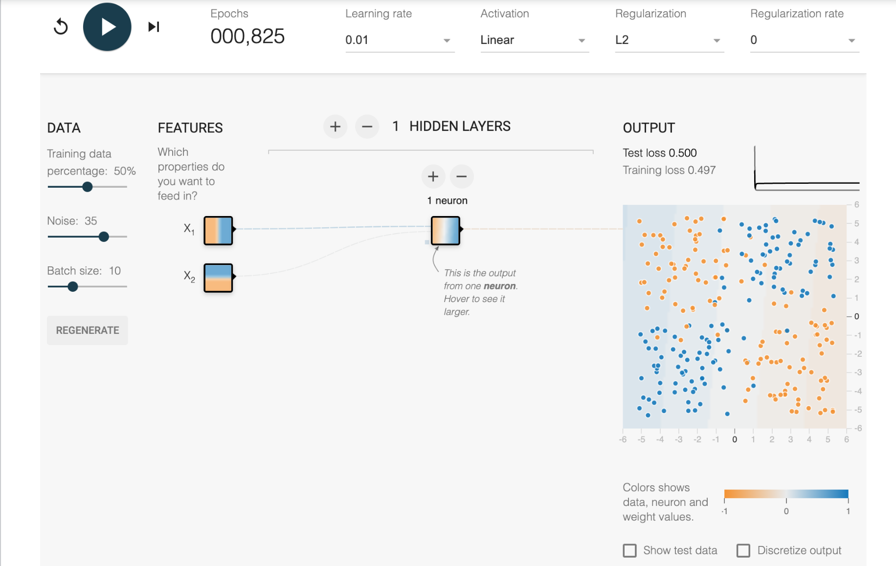

The Activation is set to Linear, so this model cannot learn any nonlinearities. The loss is very high, and we say the 
model underfits the data.

- Task2: 1 hidden layer with 2 neurons

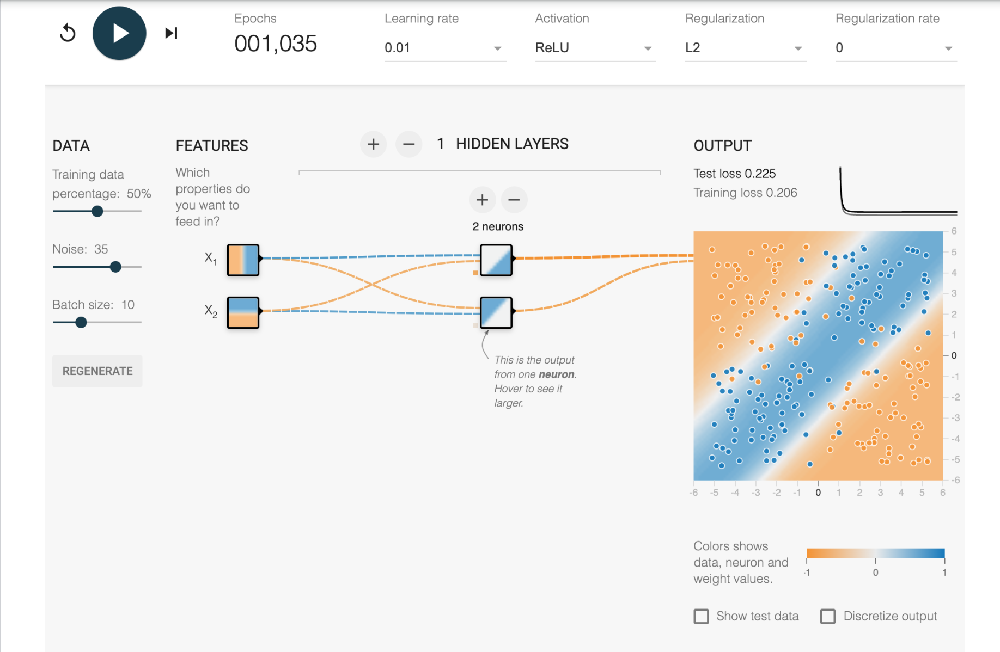

The Activation is set to ReLu, but this model cannot reflect all the nonlinearities in this data set. 
It still underfits the data. 

- Task3: 1 hidden layer with 3 neurons

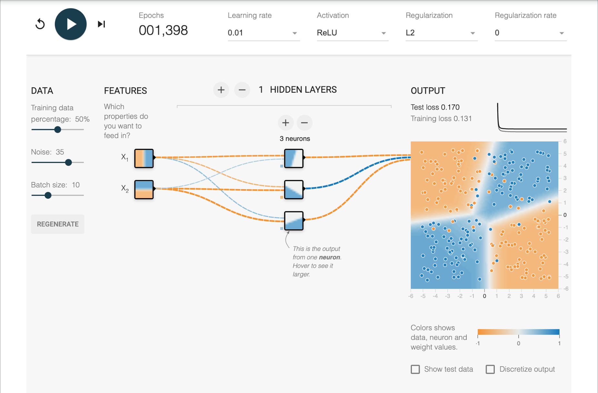

A single hidden layer with 3 neurons is enough to model the data set. because the 📍XOR function can be expressed 
as a combination of 3 half-planes (ReLU activation). You can see this from looking at the neuron images, 
which show the output of the individual neurons. 

❓❓❓❓❓❓❓❓

📍XOR function

It is the short version of "Exclusive or"

Exclusive or or exclusive disjunction is a logical operation that outputs true only when inputs differ.

Truth Table:

| Input - A| Input - B | Output | 
|---|----|---- |
| 0 | 0 | 0 |
| 1 | 0 | 1 |
| 0 | 1 | 1 |
| 1 | 0 | 0 |

Ref: https://en.wikipedia.org/wiki/Exclusive_or

❓❓❓❓❓❓❓❓❓

In a good model with 3 neurons and ReLU activation, there will be:

    1 image with an almost vertical line, detecting X1 being positive (or negative; the sign may be switched), 
    1 image with an almost horizontal line, detecting the sign of X2, 
    1 image with a diagonal line, detecting their interaction.

- Task4 : 3 hidden layers

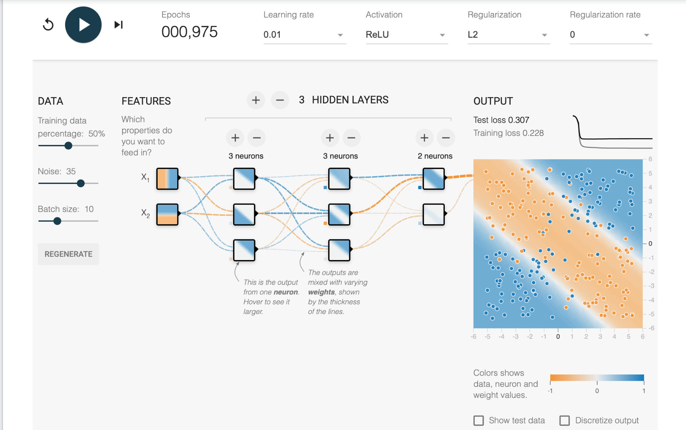

- The first layer will have the ability to try lots of different line slopes. 
- The second layer will have the ability to accumulate them into lots of different shapes, 
with lots and lots of shapes on down through the subsequent layers.

The model to start easily overfitting on the noise in the training set, rather than the generalized ground truth.

It actually performs worse than the simpler model with just enough neurons to solve the problem.

#### Examples for Initialization

The learned model had different shapes on each run. The converged test loss varied almost 2X from lowest to highest.

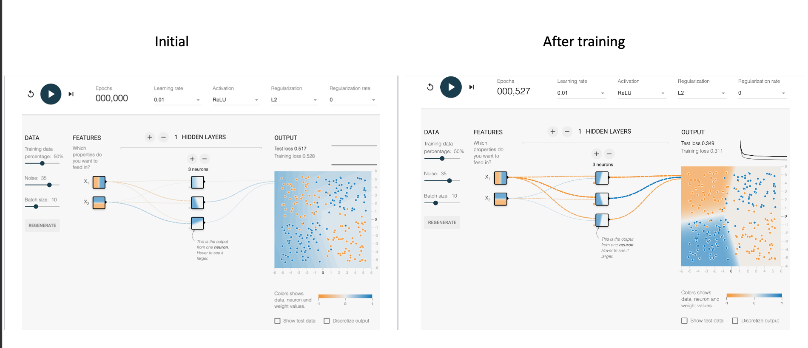

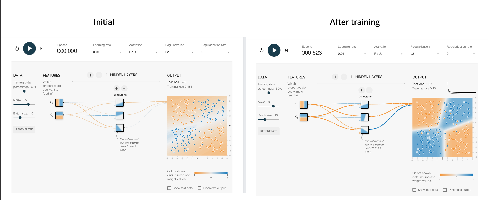

Does adding more layers and neurons help?

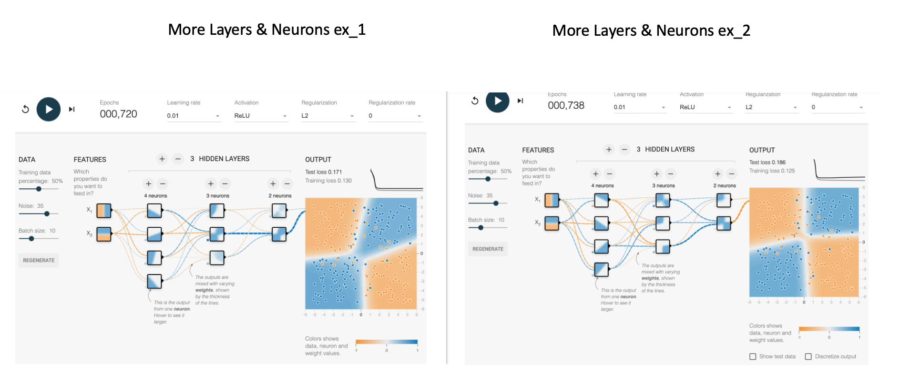

Adding the layer and extra nodes produced more repeatable results. On each run, the resulting model looked roughly the 
same. Furthermore, the converged test loss showed less variance between runs.

#### Examples for Neural Net Spiral

This data set is a noisy spiral. Here; I tried different models:

Any of them doesn't give a good test loss =(

Let's add additional cross product features or other transformations. 

I've start with X1X2, sin(X1) and sin(X2):

Here tanh activation function is used for the same features:

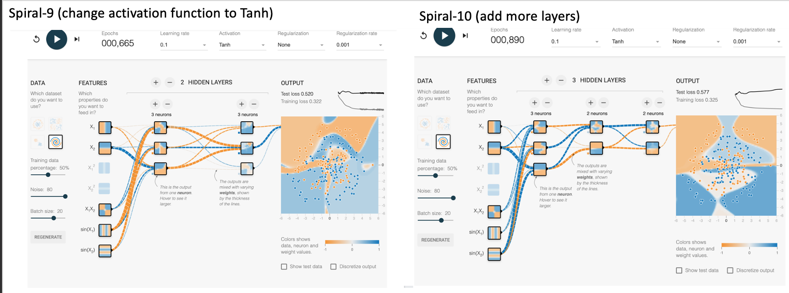

I tried other features and layers combinations. I think the best loss is coming from the Spiral-14:

#### The solution provided by Google. 

Better than my work :(

:) It seems that I need to add more and more neurons, this model is much more complex than I thought. 

#### Start with only X1 & X2 

 

- There are 6 layers and 8 neurons in each layer.
- This model is not very interpretable. 
- The first layer makes sense, it is linear features at different angles. 
- Some of the features are not very clear. 
- And it is really slow :(

#### We can use less neurons but more features

 

- It is not simple but better. 
- We can reduce the learning rate so that we don't get all of that jumping back and forth in the loss curve. 
- But this doesn't change the test loss.

#### We can use regularization

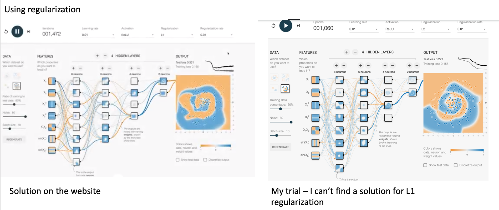 

- It penalizes complex models and overfitting. 
- Make sure that the regularization isn't too high or it won't learn any complexity in the model. 
- We're getting better :)

#### Let's use X1X2 & sin(X1) & sin(X2) 🧡

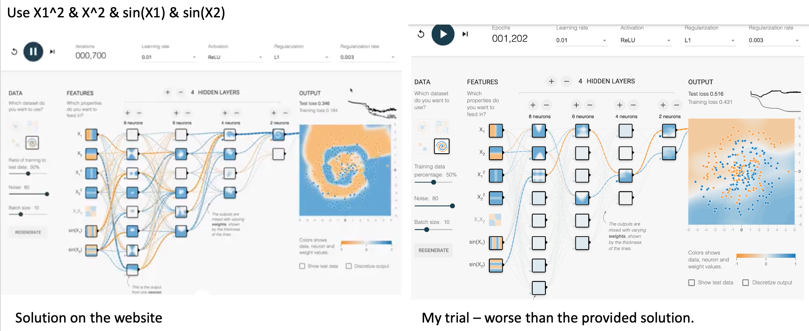 

- One of the major things you notice by adding more complex features is that especially on the first layer of the model,
the features are much more complex.
- The neurons are learning more complex than just at different slopes.  
- By adding the more complex features, We're learning at much faster rate. 
- But there are too many nodes in the network :(

#### Let's get rid of some of these layers and neurons 🧡
 
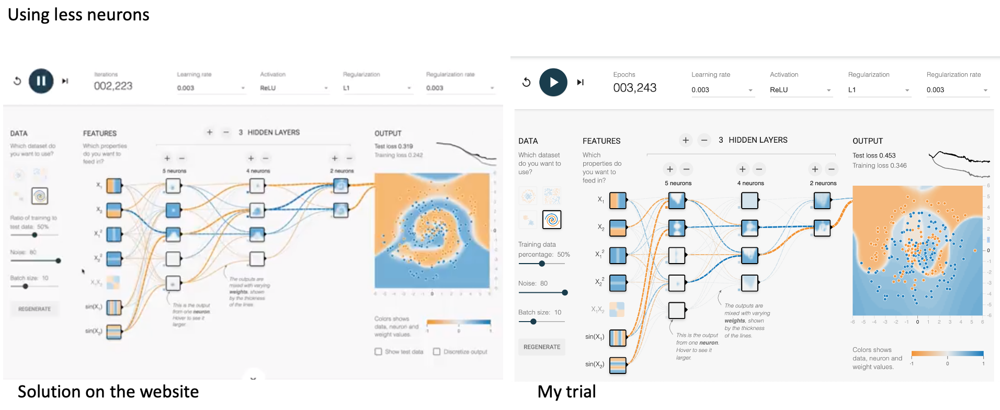 

- By reducing # layers and neurons and also we've turned down the learning rate: 

    - much smoother loss curve. 
    - fit data much better
    - not overfitting the data
    

#### Very very simple model 💛
    
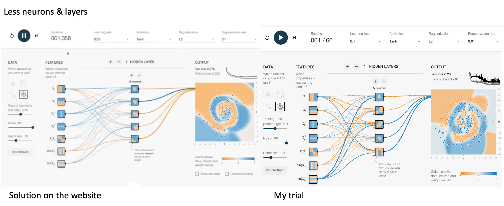 

    - better test loss
    - much smoother fitting curve
    - converging quickly
    
#### Useful Tips:
 
- You can change the batch size 
    - if it is too small it takes a really long time for your model to train.
    - if it is too large, it may have trouble converging. 
        
- You can change the learning rate:
    - if it is too high it may jump around a lot and have trouble converging. 
    
    
#### Code Experiment Results:

You can find the mean squared error of each run below:

[Code path](machine_learning/neural_networks/intro_nn.py)

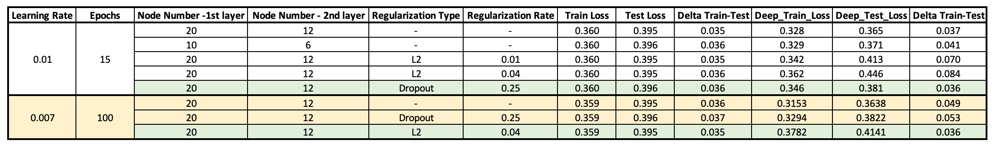
    
        

 